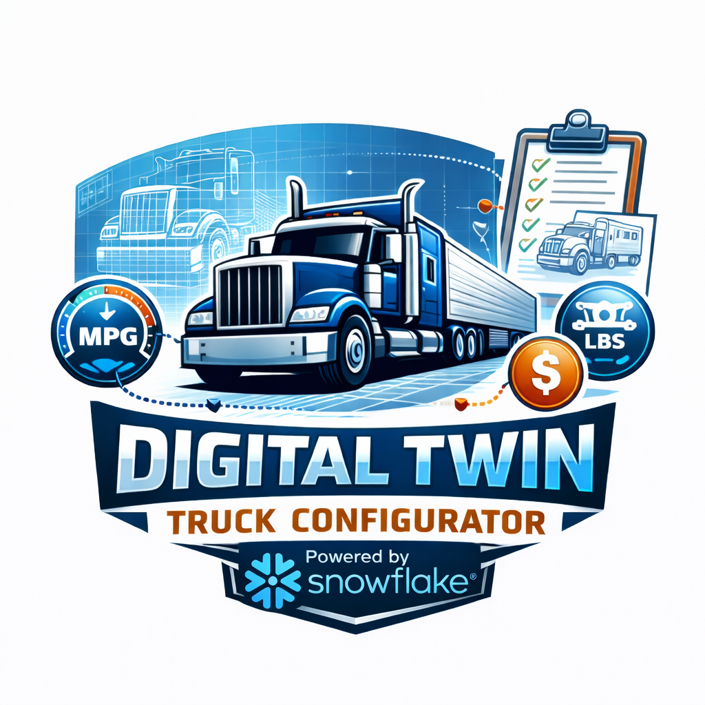

<p align="center">
  
</p>

# Digital Twin Truck Configurator V2

An AI-powered truck configuration tool running on Snowpark Container Services (SPCS) with Cortex AI integration.

**V2 uses Key-Pair JWT authentication** (replaces PATs from V1), safely reuses existing RSA keys, and includes network policy hardening for Snowflake SE demo accounts.

## What This Demo Shows

This proof-of-concept demonstrates how Snowflake's unified data platform can revolutionize complex product configuration:

1. **Understand Engineering Specifications** — Upload PDF documents and watch AI extract validation rules
2. **Match Components by Specs, Not Names** — AI compares actual technical specifications (horsepower, torque, weight ratings)
3. **Provide Intelligent Recommendations** — Natural language requests like "Maximize comfort under $100k" translate to optimal configurations
4. **Validate Configurations Automatically** — AI reads specs, identifies mismatches, and proposes fixes

## Architecture

```
SPCS Container
+------------------------------------------+
|  Next.js Frontend (port 3000)            |
|    -> Cortex Agent REST API (JWT)        |
|    -> Cortex Analyst REST API (JWT)      |
|                                          |
|  Python Backend (port 8000)              |
|    -> Snowflake SDK (Key-Pair Auth)      |
|    -> Cortex Complete (SQL function)     |
|    -> Cortex Search (SQL function)       |
|                                          |
|  Nginx (port 8080) -> reverse proxy     |
+------------------------------------------+
         |
         v
  SNOWFLAKE_PRIVATE_KEY_SECRET (mounted as env var)
         |
         v
  JWT Token Generation (account LOCATOR based)
         |
         v
  Cortex Agent / Analyst / SDK
```

### Container Services

| Service | Port | Description |
|---------|------|-------------|
| **nginx** | 8080 (external) | Reverse proxy: `/api/*` to backend, all else to frontend |
| **FastAPI Backend** | 8000 | Python APIs for Snowflake/Cortex operations |
| **Next.js Frontend** | 3000 | React UI with TypeScript |

### Cortex AI Services Used

| Service | Purpose |
|---------|---------|
| **Cortex Agent** | Orchestrated AI chat assistant with tool access |
| **Cortex Analyst** | Natural language to SQL via semantic view |
| **Cortex Complete** | Rule extraction from engineering documents |
| **Cortex Search** | Semantic search over engineering specification PDFs |
| **PARSE_DOCUMENT** | PDF text extraction |

## Prerequisites

- Snowflake account on **AWS** (Cortex AI features require AWS)
- ACCOUNTADMIN role (or equivalent privileges)
- Docker Desktop (for building the container image)
- Snowflake CLI (`pip install snowflake-cli`)
- Python 3.11+ (for JSON parsing in setup script)
- openssl (for RSA key generation)

> **Note**: No `jq` dependency — all JSON parsing uses `python3`.

## CLI Connection Setup

The setup script uses the Snowflake CLI (`snow`) to connect. You must configure **key-pair JWT authentication** in your CLI connection — browser-based auth will not work because the setup script runs non-interactively.

### 1. Generate an RSA Key Pair (if you don't have one)

```bash
mkdir -p ~/.snowflake/keys
openssl genrsa 2048 | openssl pkcs8 -topk8 -inform PEM -outform PEM -nocrypt > ~/.snowflake/keys/<connection_name>.p8
chmod 600 ~/.snowflake/keys/<connection_name>.p8
```

Assign the public key to your Snowflake user:
```bash
openssl rsa -in ~/.snowflake/keys/<connection_name>.p8 -pubout -out /tmp/key.pub
PUBLIC_KEY=$(grep -v 'BEGIN\|END' /tmp/key.pub | tr -d '\n')
```
```sql
ALTER USER <username> SET RSA_PUBLIC_KEY='<PUBLIC_KEY>';
```

### 2. Configure `~/.snowflake/connections.toml`

```toml
[<connection_name>]
account = "<ORG>-<ACCOUNT>"
user = "<USERNAME>"
authenticator = "SNOWFLAKE_JWT"
private_key_file = "~/.snowflake/keys/<connection_name>.p8"
role = "ACCOUNTADMIN"
```

**Key points:**
- `authenticator` must be `SNOWFLAKE_JWT` (not `externalbrowser`)
- `private_key_file` points to the `.p8` key from step 1
- Do NOT set `warehouse` — the setup script creates one

### 3. Configure `~/.snowflake/config.toml`

```toml
default_connection_name = "<connection_name>"
```

### 4. Verify

```bash
snow sql --connection <connection_name> -q "SELECT CURRENT_USER()"
```

## Quick Start

```bash
git clone https://github.com/azbarbarian2020/Digital_Twin_Truck_Configurator_v2.git
cd Digital_Twin_Truck_Configurator_v2
./setup.sh
```

**Estimated time**: 10-20 minutes (mostly Docker build + SPCS startup)

The setup script will:

1. Prompt for your Snowflake CLI connection name
2. Auto-detect your account, host, and registry
3. Prompt for database, schema, warehouse, and compute pool names
4. Create all infrastructure (database, schema, warehouse, compute pool, image repo)
5. Set up RSA key-pair authentication (with safe key management)
6. Create network rules and external access integration
7. Load BOM data (253 options with SPECS), truck options, and app tables
8. Create semantic view for Cortex Analyst
9. Harden network policies (three-part fix for SE demo accounts)
10. Build and push the Docker image (`linux/amd64`)
11. Deploy the SPCS service
12. Print the application URL

### Safe Key Management

If you already have an RSA key configured for another SPCS app (like midstream-pdm_v2), the setup script will detect this and offer options:

1. **Reuse existing key** — Auto-detected from `connections.toml` (recommended if key file found)
2. **Use RSA_PUBLIC_KEY_2** — Both apps work simultaneously (recommended if no key file found)
3. **Generate new key** — Warning: breaks other SPCS apps

## Demo Flow (2-3 minutes)

### 1. Model Selection (20s)
- View 5 truck models: Regional Hauler, Fleet Workhorse, Cross Country Pro, Heavy Haul Max, Executive Hauler
- Use "Find My Model" wizard — AI recommends best match with percentage score and reasons

### 2. BOM Navigation (25s)
- Navigate hierarchical Bill of Materials: System > Subsystem > Component Group
- View pricing, weight, and performance ratings (Safety, Comfort, Power, Economy)
- Real-time summary shows total price, weight, and performance vs default

### 3. Configuration Assistant (30s)
- Select the **Heavy Haul Max HH-1200** model
- Open AI chat and ask: *"Maximize comfort and safety while minimizing all other costs"*
- AI analyzes all 253 options and recommends optimal configuration
- One-click "Apply" updates configuration instantly

### 4. Engineering Spec Validation (45s) - KEY FEATURE
- Select **Engine > Engine Block > Power Rating > 605 HP / 2050 lb-ft Maximum**
- Upload `605_HP_Engine_Requirements.pdf` (from `public/docs/`)
- AI extracts validation rules from document text
- Click "Verify Configuration" — AI compares spec requirements against BOM_TBL SPECS
- View configuration violations with specific spec mismatches
- Click "Apply Fix Plan" to auto-resolve issues

### 5. Save & Compare (25s)
- Save configuration with AI-generated description
- Compare multiple builds side-by-side
- Export full configuration report

## What's Different from V1

| Feature | V1 | V2 |
|---------|----|----|
| Auth method | PAT (manual token entry) | Key-Pair JWT (auto-detected from CLI) |
| Key management | None (could break other apps) | Safe: detect, reuse, verify fingerprint |
| REST API auth | `Snowflake Token=` (broken for Agent) | `Bearer` + `KEYPAIR_JWT` header |
| JWT account ID | Org-account with underscore hack | Account LOCATOR (correct) |
| Network policy | None | Three-part hardening for SE demo accounts |
| EAI | Missing auth secrets | Includes `ALLOWED_AUTHENTICATION_SECRETS` |
| Service secrets | `snowflakeName:` (wrong key) | `snowflakeSecret: objectName:` (correct) |
| SQL parameterization | `sed -i.bak` (mutates source files) | Template substitution to temp files |
| Teardown | None | `teardown.sh` (preserves RSA keys) |
| Hardcoded values | `SFSENORTHAMERICA-AWSBARBARIAN` | All parameterized |

## Data Model

| Table | Description | Rows |
|-------|-------------|------|
| **BOM_TBL** | Bill of Materials with SPECS (JSON technical specifications) | 253 |
| **MODEL_TBL** | Truck model definitions | 5 |
| **TRUCK_OPTIONS** | Maps options to models with defaults | 868 |
| **VALIDATION_RULES** | AI-extracted rules from engineering docs | Dynamic |
| **ENGINEERING_DOCS_CHUNKED** | Searchable document chunks for RAG | Dynamic |
| **SAVED_CONFIGS** | User-saved configurations | Dynamic |
| **CHAT_HISTORY** | Chat conversation history | Dynamic |

### SPECS Column (BOM_TBL)

Each BOM option has technical specifications stored as a VARIANT (JSON) column. This is critical for validation — the system compares VALIDATION_RULES min/max values against these SPECS:

```json
{
  "boost_psi": 48,
  "max_hp_supported": 650,
  "turbo_type": "twin-vgt"
}
```

### Snowflake Objects

```
<DATABASE>.<SCHEMA>/
  Tables: MODEL_TBL, BOM_TBL, TRUCK_OPTIONS, SAVED_CONFIGS
  Tables: ENGINEERING_DOCS_CHUNKED, VALIDATION_RULES, CHAT_HISTORY
  Stage: ENGINEERING_DOCS_STAGE
  Search: ENGINEERING_DOCS_SEARCH (Cortex Search Service)
  View: TRUCK_CONFIG_ANALYST_V2 (Semantic View)
  Secret: SNOWFLAKE_PRIVATE_KEY_SECRET
  Repo: TRUCK_CONFIG_REPO
  Service: TRUCK_CONFIGURATOR_SVC
```

## Project Structure

```
Digital_Twin_Truck_Configurator_v2/
  app/                        # Next.js frontend
    api/                      # Next.js API routes (proxy to backend)
    layout.tsx                # Root layout
    page.tsx                  # Main page
  backend/                    # FastAPI backend
    main.py                   # Python API endpoints (all Snowflake/Cortex logic)
    requirements.txt
  components/                 # React components
    Configurator.tsx          # Main configurator UI
    ChatPanel.tsx             # AI chat assistant
    Compare.tsx               # Config comparison
    ConfigurationReport.tsx   # BOM report
    ModelSelection.tsx        # Model picker
    Header.tsx
    Skeleton.tsx
  lib/                        # Shared utilities
    api-config.ts             # API endpoint configuration
    snowflake.ts              # Snowflake connection helpers
    utils.ts                  # General utilities
  public/
    docs/                     # Sample engineering spec PDFs
    *.png                     # Truck model images
  scripts/                    # SQL deployment scripts
    01_infrastructure.sql     # Database, schema, warehouse, compute pool
    02_data.sql               # MODEL_TBL data
    02b_bom_data.sql          # BOM_TBL data (253 rows with SPECS)
    02c_truck_options.sql     # TRUCK_OPTIONS mappings
    02d_app_tables.sql        # VALIDATION_RULES, ENGINEERING_DOCS_CHUNKED, etc.
    02e_upload_procedure.sql  # Document upload/parse stored procedure
    03_semantic_view.sql      # Cortex Analyst semantic view
    05_service.sql            # Service creation template (manual reference)
  setup.sh                    # Full automated deployment
  teardown.sh                 # Safe cleanup (preserves RSA keys)
  fix_network_policy.sh       # Fix after 12-hour enforcement task
  Dockerfile                  # Multi-stage build (frontend + backend + nginx)
  nginx.conf                  # Reverse proxy config
  TROUBLESHOOTING.md          # Common issues and fixes
```

## Scripts

| Script | Purpose |
|--------|---------|
| `./setup.sh` | Full automated deployment (interactive prompts) |
| `./teardown.sh` | Safe cleanup (preserves RSA keys and user network policies) |
| `./fix_network_policy.sh` | Fix after 12-hour enforcement task |

## Network Policy (SE Demo Accounts)

Snowflake SE demo accounts run `ACCOUNT_LEVEL_NETWORK_POLICY_TASK` every 12 hours, which resets the account-level network policy and can wipe SPCS CIDRs. The setup script applies a three-part fix:

1. **Account-level**: Adds SPCS CIDR `153.45.59.0/24` to the current policy
2. **Enforcement procedure**: Updates the stored procedure to include SPCS CIDR
3. **User-level**: Creates a user-specific policy that is immune to account resets

If SPCS stops working after ~12 hours, run:
```bash
./fix_network_policy.sh
```

## Environment Variables (SPCS Container)

| Variable | Source | Description |
|----------|--------|-------------|
| `SNOWFLAKE_PRIVATE_KEY` | Secret mount | RSA private key PEM |
| `SNOWFLAKE_ACCOUNT_LOCATOR` | Service spec | Account locator (e.g., `LNB24417`) |
| `SNOWFLAKE_ACCOUNT` | Service spec | Org-account format |
| `SNOWFLAKE_HOST` | Service spec | Full hostname |
| `SNOWFLAKE_USER` | Service spec | Snowflake username |
| `SNOWFLAKE_WAREHOUSE` | Service spec | Warehouse name |
| `SNOWFLAKE_DATABASE` | Service spec | Database name |
| `SNOWFLAKE_SCHEMA` | Service spec | Schema name |
| `SNOWFLAKE_SEMANTIC_VIEW` | Service spec | Fully qualified semantic view |

## Engineering Specification Documents

Sample engineering specifications are included in `public/docs/`:

| Document | Purpose |
|----------|---------|
| `605_HP_Engine_Requirements.pdf` | Validates turbocharger, radiator, transmission for 605 HP engine |
| `ENG-605-MAX-Technical-Specification.pdf` | Extended 605 HP engine technical specification |
| `AXLE-HEAVY-DUTY-Specification.pdf` | Heavy-duty front axle compatibility requirements |
| `Heavy_Duty_Cooling_Package_Requirements.pdf` | Cooling system requirements for heavy-duty configurations |

## Updating an Existing Deployment

```bash
# 1. Build new image (MUST be linux/amd64 for SPCS)
docker buildx build --platform linux/amd64 --no-cache -t truck-config:v2-new .

# 2. Login and push
snow spcs image-registry login --connection <conn>
REGISTRY=<org-account>.registry.snowflakecomputing.com
HTTPS_PROXY="" HTTP_PROXY="" NO_PROXY="$REGISTRY" \
  docker tag truck-config:v2-new $REGISTRY/<db>/<schema>/truck_config_repo/truck-config:v2-new
HTTPS_PROXY="" HTTP_PROXY="" NO_PROXY="$REGISTRY" \
  docker push $REGISTRY/<db>/<schema>/truck_config_repo/truck-config:v2-new

# 3. Update service (use snow sql CLI, not Snowsight for multiline YAML)
snow sql --connection <conn> -q "ALTER SERVICE <db>.<schema>.TRUCK_CONFIGURATOR_SVC
FROM SPECIFICATION \$\$
spec:
  containers:
    - name: truck-configurator
      image: /<db>/<schema>/truck_config_repo/truck-config:v2-new
      ...
\$\$"
```

> **Important**: Use `HTTPS_PROXY="" HTTP_PROXY="" NO_PROXY="$REGISTRY"` before `docker push` to bypass VPN transparent proxies (Docker Desktop VpnKit).

## Troubleshooting

See [TROUBLESHOOTING.md](TROUBLESHOOTING.md) for common issues and fixes.

## License

MIT License
